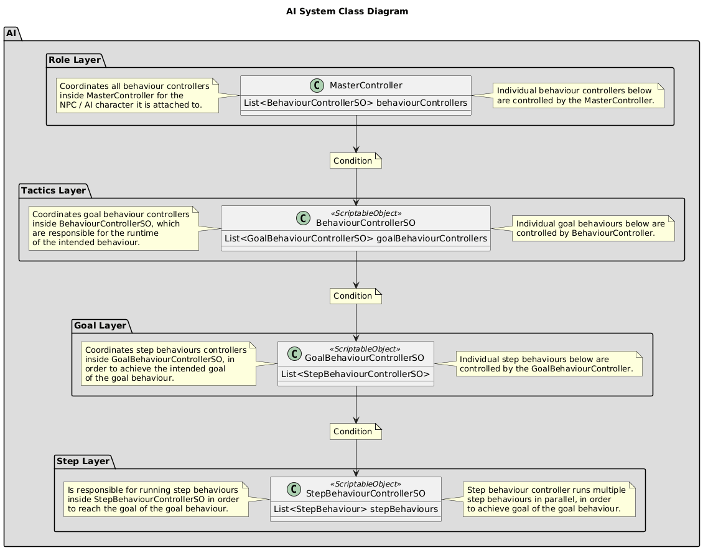
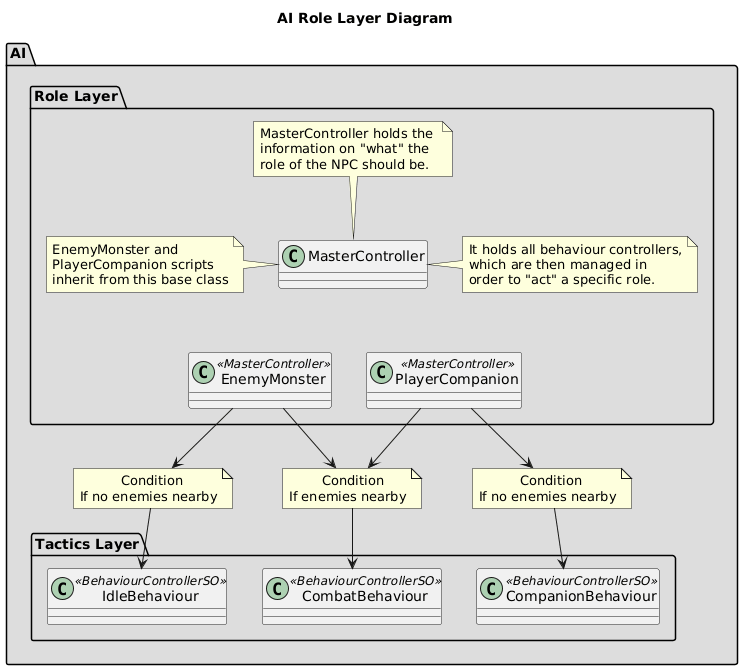
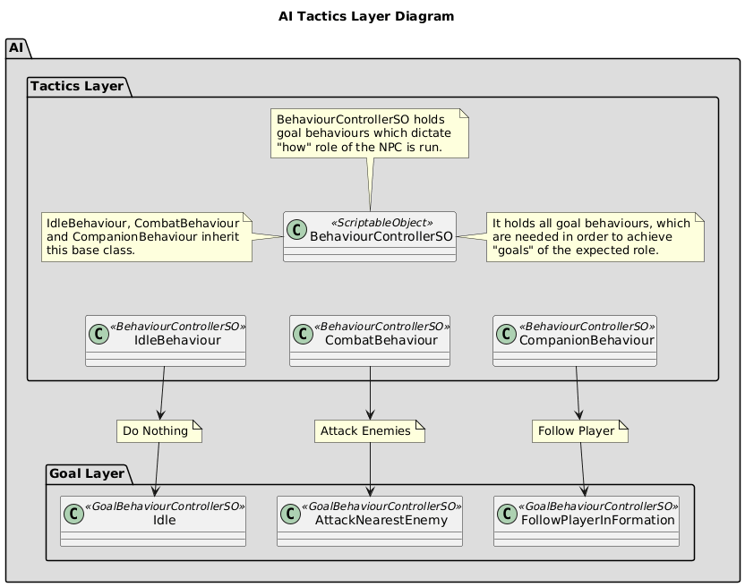
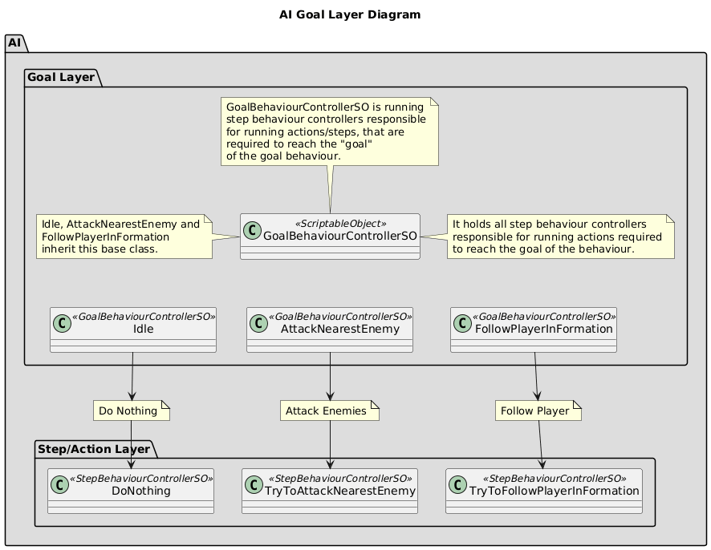

# Introduction

If it's not clear, this is not Large Language Model (LLM) AI, but a Logic-Based AI. No ChatGPT or Claude self-aware AI here folks.

This repo contains the AI system that I used for the Ticorporate Demo Lab Project Valiant Attempt.
If you're not a programmer, and/or don't know how finite state machines, behaviour trees and rule-based decision making works,  this description will likely go over your head.

I've done my best to try to explain it in succint and clear manner, but I'm not sure how well I can explain this in to another programmer, let alone to someone who has no programming, technical or system design expertise when it come to logic-based AI.

I'll try to go over how the AI works and try to explain it in detail with flowcharts and diagrams, that someone who would be interested in hiring me would be able gauge my skills and whether I would be a good fit for the team or not.

## Disclaimer

Before we start, I want to make it absolutely clear that I'll be completely focusing on the AI system
itself here, while leaving the components that are needed for the AI to work, out of the scope for system.

There are many, many components that are needed for the AI to be able to function, which I will not be explaining or sharing here, because it would way too verbose. I will explain the main execution flow of how the AI works, rather than the ecosystem which makes running the AI possible, which is massive.

This AI is designed to be modular in way so it's not inherently dependant on the systems or components that it is using, but for the outputs that the assigned components produce. What this means is that if you were to use this AI, and want to write the your own custom systems that produce the required outputs for the required inputs that the AI needs to function, it should be possible to do so.

## About how the AI system works.

As you can see, there are four layers for the main AI function loop.

For now I'll explain the general twist of how the AI works, but I'll explain each layer in detail later when we go through them one by one. The AI system that I've created relies heavily on rules, or as I like to call them "conditions", which decide when AI is going to do something. Creating and managing conditions on when to run or not run behaviours or actions is how one creates behaviours and manages actions with this system.

Each layer is an individual finite state machine responsible for running different BehaviourControllers for the AI decision making. They responsible for running individual states inside controllers, in order to fulfill a purpose for the NPC in question.

Each layer controls the controller of the layer below it, this creates a execution flow in which each layer runs different controllers for the states below them, based on the conditions in the controller controlling the layers.

Every state machine runs the same way, running one state at a time with the priority being the one on top of the list, with the exception being the StepBehaviourController in Step/Action Layer, in which we need to run and manage actions in parallel, in order to make the AI able to do multiple actions at the same time.

### 1st Layer: MasterController I.e. The Role Layer of the AI.

MasterController is "WHAT" of the AI. This is usually named after the name of NPC.
(Companion, Bandit Melee, Bandit Ranged, Player Ally, etc.)

MasterController holds all information and components that are required by the AI to function. States use it container to access all required information and components, which produce outputs for the AI to run properly. It is responsible for deciding which BehaviourControllers to use. It uses that information to decide what kind of "role" it should take depending on the conditions assigned into the AI roles or behaviours.

Example: For a Companion NPC it could be checking if there are enemies nearby.
If there are no enemies nearby: It could assume the role of a "Companion" with a behaviour matching that of a companion NPC.
If there are enemies nearby, it switches to CombatBehaviour, which is the behaviour that is run when it has detected enemies and starts fighting them.

### 2nd Layer: BehaviourController I.e. The Tactics Layer of the AI.

Tactics layer is the "HOW" of the AI. It decides how the AI is run.

BehaviourController in the Tactics Layer assumes that the MasterController in the Role Layer has decided on a role, which now needs a set of specific instructions, in order to fulfill the role in question.

It holds GoalBehaviourControllers, which it uses for setting up a list of goals for the BehaviourController to achieve. These goals have rules or conditions associated with them to run the properly, which depend on the conditions that have been set up in the GoalBehaviourController.

Example: 
For CombatBehaviour, it could have a single GoalBehaviourController called "AttackNearestEnemy". It will try to attack nearest enemy with whatever means it has at it's disposal.

For CompanionBehaviour, it could have a single GoalBehaviourController called "FollowPlayerInFormation". It will try to follow player in formation when not in combat.

### 3rd Layer: GoalBehaviourController I.e. The Goal Layer of the AI.

Goal Layer is the "INTENT" of the AI.

Goal Layer is responsible for setting up the list of actions that need to be taken to make sure that the AI reaches the goal of the GoalBehaviourController. It then forwards these set of instructions to the StepBehaviourController below it.

Example:
FollowPlayerInFormation goal needs to run TryToFollowPlayerInFormation set of instructions for the StepBehaviourController in order to achieve the desired goal and behaviour for the NPC.

### 4th Layer: StepBehaviourController I.e. The Step/Action Layer of the AI.

Step/Action Layer is the last layer, the "ACTION TAKEN" by the AI.

StepBehaviourController is responsible for fulfilling the "intent" of the GoalBehaviourController through managing and running of action states within the StepBehaviourController. Action states are where the concrete actions that AI takes are run.

Action states within StepBehaviourControlle are run in parallel, with conditions tied to the action state deciding when state is run.

Example:

AttackNearestEnemy GoalBehaviourController has a set of actions for the TryToAttackNearestEnemy StepBehaviourController to be run in order to reach the desired outcome of the goal.

If the AI doesn't have a target. It runs "FindEnemyTarget" Action state, I.e. "Action" to find a target for the player and select it.

If the AI doesn't have a skill or attack selected to attack with, it runs "SelectSkillToAttackWith" Action State to select a skill to attack with.

If the AI is not in position to attack due to range or other constraints, it will move into position to attack using "MoveToAttackWithSkill".

And finally, if the skill that the AI is using not on cooldown, out of resources to activate the skill or whatever, it will attack the target with the selected skill.

These set of instructions are run infinitely until the conditions for enabling the actions or behaviours have changed.

I.e. CombatBehaviour is on as long as there are enemies nearby that can be attacked or skill can be used to attack enemies as long as it's not on cooldown, we are not in range, we don't have a valid target or skill to attack with.

Since action states are run in parallel the AI will just stay close to enemy and do nothing, if it cannot attack enemy for whatever reasons.