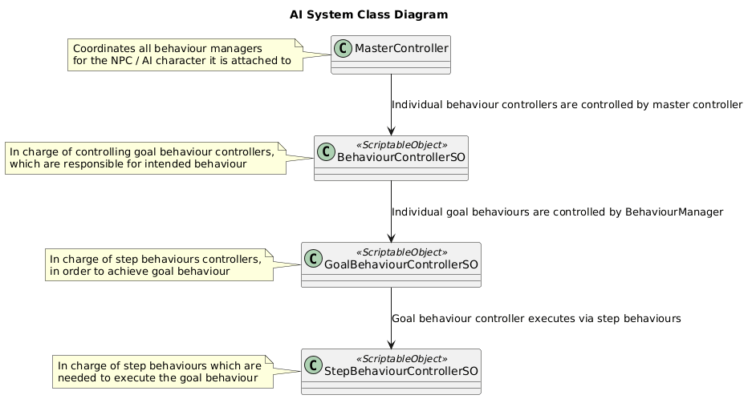

# Introduction

In case it was not clear, this is not Large Language Model AI, but a Logic-Based AI. No ChatGPT or Claude self-aware AI here folks.

This repo contains the AI system that I used for the Ticorporate Demo Lab Project Valiant Attempt.
If you're not a programmer, and don't know how state machines work or how
Goal Oriented Action Pattern AI (GOAP) works in general this will likely go over your head.

Even I'm not sure if I can explain this in a coherent manner to another programmer, let alone to someone
who has no technical or system design expertise.

I'll try to go over how the AI works and try to explain it in detail with flowcharts and diagrams, that someone who would be interested
in hiring me would be able gauge my skills and whether I would be a good fit for the team or not.

## Disclaimer

Before we even start, I want to make it absolutely clear that I'll be completely focusing on the AI system
itself here, while leaving the components that are needed for the AI to work out.

There are many, many components that are needed for the AI to be able to function, which I will not be explaining in detail here,
because it would way too verbose, and again I want to focus on the AI system, rather than whole which makes it possible for the AI to function.

This AI is designed in a modular way, that this system is not inherently dependant
on those components themselves, but for the outputs that the assigned components should produce.
What this means is that if you want to use this AI, and want to write the your own custom systems that produce the required outputs yourself,
rather than using the ones I used for the Valiant Attempt, it should be possible to do so.

## About how the AI system works.

Okay let's start.

As you can see, there are four layers for the main AI function loop.
I'll first explain how the AI works, since how the AI works is exactly the same in all layers,
except for the Action layer, which I will explain later.

The important thing to note is that while every state in the state machine works the same way,
the only things that changes are CONDITIONS on which the AI decides what the states it is currently running.

In the case of GoalBehaviour, only one STATE can be active at same time, but in the case of StepBehaviours
ALL the StepBehaviours attached with the StepBehaviourController are running at the same time. I'll give example 
of what the difference is and why I've done it this way while we go through the different layers of the AI decision making.

In short, functionality of this AI is all about managing the conditions of the behaviours,
which decides how the AI is being run and if multiple conditions overlap
the condition that before has the priority over the current one. There will be a proper prioritization
system in the future, but right now it's not important enough for me to take into consideration.

### 1st Layer: MasterController I.e. The Strategy Layer of the AI.

(put flowchart here)

In here, the AI will act based on the current active conditions, which BehaviourController I.e. Strategy to use for the AI.
So as an example, this could be the layer where we decide whether the AI is following the player, in active combat, patrolling, idling or whatever.

As for an example for what triggers the change of behaviour:

If there are enemies nearby, or player is in combat, or whatever. The MasterController switches to "InCombatBehaviour"
If there are no enemies nearby, they are all dead or the combat is over, the MasterController switches to "FollowPlayer" behaviour.
If the player is interacting with something or speaking to someone in the game, the game is paused or whatever. The AI goes to "Idle" or "Suspended" mode.

### 2nd Layer: BehaviourController I.e. The Tactics Layer of the AI.
### 3rd Layer: GoalBehaviourController I.e. The Goal Layer of the AI.
### 4th Layer: StepBehaviourController I.e. The Step/Action Layer of the AI.
